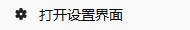

# 界面介绍

> **直观易用的界面设计** - 专为教育场景优化的现代化交互体验

## 界面概览

SecRandom采用现代化的界面设计理念，通过清晰的层次结构和直观的操作流程，让每位用户都能快速上手。界面支持**智能适配**和**个性化定制**，完美适配不同使用场景。

## 主题与个性化

### **预设主题方案**

#### **浅色主题**
- **适用场景**：教室、办公室等明亮环境
- **配色特点**：白底黑字
- **护眼指数**：⭐⭐⭐
- **能耗优化**：⭐⭐⭐⭐

#### **深色主题**
- **适用场景**：晚间使用、昏暗环境
- **配色特点**：黑底白字
- **护眼指数**：⭐⭐⭐⭐⭐
- **专注模式**：减少眼部疲劳

## 主界面功能导航

### **核心功能区**

#### **点名**

  

  

    <h4>点名</h4>
    
智能随机选择学生，支持权重和分组

  

  教育专用
  权重算法
  分组管理

#### **抽奖**

  

  

    <h4>抽奖</h4>
    
奖品抽取管理，支持多级奖项

  

  奖品管理
  多级奖项

#### **历史记录**

  

  

    <h4>历史记录</h4>
    
完整的抽取历史，支持导出分析

  

#### **设置**

  

  

    <h4>设置</h4>
    
进入设置界面

  

  抽取设置
  名单管理
  关于信息

## 系统托盘菜单

### **快速操作面板**

#### **界面控制**

| 功能图标 | 操作名称 | 功能描述 |
|----------|----------|----------|
|  | 关于信息 | 显示程序详细信息 |
|  | 显示/隐藏主界面 | 快速切换窗口显示状态 |
|  | 显示/隐藏浮窗 | 控制浮窗显示，仅当前会话有效 |
|  | 打开设置 | 快速进入设置界面 |
|  | 重启/退出 | 程序重启或安全退出 |

