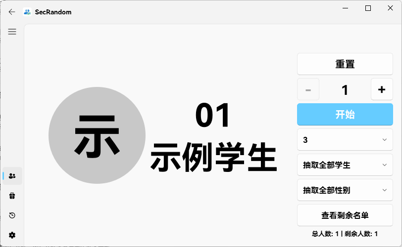

> 🎨 **个性化您的抽取体验**
> 
> 通过丰富的定制选项，打造专属于您的抽取风格和浮窗体验。

## 🎯 抽取设置

### 🎲 抽取功能

**抽取模式**：设置点名抽取模式
- 不重复抽取：每次抽取后排除已抽中人员
- 半重复抽取：允许在同一轮内重复抽取特定次数
- 允许重复：完全允许重复抽取同一人员

**清除抽取记录方式**：设置清除抽取记录的时机
- 重启后清除：软件重启时自动清除抽取记录
- 直到全部抽取完：抽取完所有人员后清除记录

**半重复抽取次数**：设置每人被抽中多少次后清除抽取记录
- 范围：1-100

**抽取方式**：设置点名抽取方式
- 随机抽取：完全随机的抽取方式
- 公平抽取：保证抽取概率相对均衡的方式

**默认抽取名单**：设置闪抽默认抽取名单

### 🎨 显示设置

**使用全局字体**：是否使用全局字体设置
- 跟随全局字体：使用系统或应用全局设置的字体
- 自定义字体：单独设置点名界面的字体

**自定义字体**：选择自定义字体
- HarmonyOS Sans SC：默认使用
- 自定义字体：选择其他自定义字体

**字体大小**：设置点名结果字体大小
- 范围：10-2000px

**结果显示格式**：设置点名结果显示格式
- 学号+姓名：先显示学号再显示姓名
- 仅姓名：只显示学生姓名
- 仅学号：只显示学生学号

**显示随机组员格式**：设置随机组员显示格式
:::tip 这是什么
随机组员：在使用抽取小组模式时，从抽到的小组内随机抽取一名成员并显示其姓名。
:::
- 不显示：不显示随机组员信息
- 组名[换行]姓名：先显示组名再换行显示姓名
- 组名[短横杠]姓名：先显示组名再用短横杠连接姓名

### 🎬 动画设置

**动画模式**：设置点名抽取动画效果
- 自动播放动画：抽取时自动播放滚动动画
- 手动停止动画：通过手动操作停止动画播放
- 直接显示结果：抽取完成后直接显示最终结果，不播放动画

**动画间隔**：设置点名动画间隔时间（毫秒）

**自动播放次数**：设置点名动画自动播放次数

### 🎨 颜色主题设置

**动画/结果颜色主题**：设置点名动画/结果颜色
- 关闭：使用默认颜色样式
- 随机颜色：每次抽取使用随机颜色
- 固定颜色：使用固定颜色作为动画和结果的显示颜色

**动画/结果固定颜色**：如果上面选择了固定颜色，则在此处设置点名动画/结果固定颜色

### 🖼️ 学生头像设置

**显示学生图片**：设置是否在抽取页面显示学生图片  
示例：  
  

**学生图片文件夹**：管理学生图片文件
- 图片文件名需与学生姓名一致
- 操作：点击「学生图片文件夹」按钮打开学生图片文件夹

## 🪟 浮窗管理

### ⚙️ 基本设置

**启动时显示浮窗**：控制软件启动时是否自动显示浮窗

**浮窗透明度**：调整浮窗透明度
- 范围：0%-100%

**浮窗可拖动**：控制浮窗是否可被拖动
- 启用：允许拖动浮窗到任意位置
- 禁用：浮窗固定在当前位置不可拖动

**长按时间**：设置拖动浮窗前需要长按浮窗的时间

**重置浮窗位置**：将浮窗位置重置为默认位置（一般位于屏幕的左上角）

### 🎨 外观设置

**浮窗控件配置**：选择在浮窗中显示的功能按钮
- 点名：只显示点名功能按钮
- 闪抽：只显示闪抽功能按钮
- 抽奖：只显示抽奖功能按钮
- 点名+闪抽：同时显示点名和闪抽功能按钮
- 点名+抽奖：同时显示点名和抽奖功能按钮
- 闪抽+抽奖：同时显示闪抽和抽奖功能按钮
- 点名+闪抽+抽奖：同时显示点名、闪抽和抽奖功能按钮

**浮窗排列方式**：设置浮窗中控件排列方式
- 横向排列：控件水平方向排列
- 纵向排列：控件垂直方向排列
- 矩形排列：控件以矩形布局排列

**浮窗显示样式**：设置浮窗中控件显示样式
- 图标+文字：同时显示功能图标和文字说明
- 仅图标：只显示功能图标
- 仅文字：只显示功能文字

**浮窗大小**：设置浮窗按钮和图标的大小  
注：浮窗大小均为1920x1080 100%缩放的数据，不同缩放比例下可能会存在差异
| 名称   | 主浮窗按钮大小 | 收纳浮窗按钮大小 |
|--------|----------------|------------------|
| 超级小 | 20px×20px          | 20px×20px            |
| 超小   | 30px×30px          | 25px×25px            |
| 小     | 40px×40px          | 28px×28px            |
| 中     | 50px×50px          | 30px×30px            |
| 大     | 60px×60px          | 35px×35px            |
| 超大   | 70px×70px          | 40px×40px            |
| 超级大 | 80px×80px          | 45px×45px            |

### 📏 贴边设置

**贴边功能**：控制浮窗靠近屏幕边缘时是否自动收纳为悬浮按钮

**贴边收纳时间**：设置浮窗移动到边缘到收纳的时间间隔

**贴边显示样式**：设置浮窗收纳为悬浮按钮时的显示样式
- 文字：显示文字提示
- 图标：显示功能图标
- 箭头：显示箭头

## 💡 个性设置小贴士

### 🎯 抽取设置优化

- **显示效果**：根据教室大小调整字体大小，确保后排学生也能清晰看到
- **动画体验**：适当调整动画间隔和播放次数，平衡视觉效果和抽取效率
- **个性化主题**：开启颜色主题或设置艺术字体，让抽取过程更加生动

### 🪟 浮窗设置技巧

- **便捷操作**：按钮数量设置为”抽人+闪抽“，提升课堂抽取效率
- **界面整洁**：根据实际情况选择浮窗控件和显示样式，减少视觉干扰
- **智能贴边**：利用贴边功能，既保持浮窗便捷性，又不影响其他软件使用

> 📚 **更多帮助**：如有个性设置相关问题，欢迎查看[常见问题](/faq/001.md)或[联系我们](/team.md)获取支持！