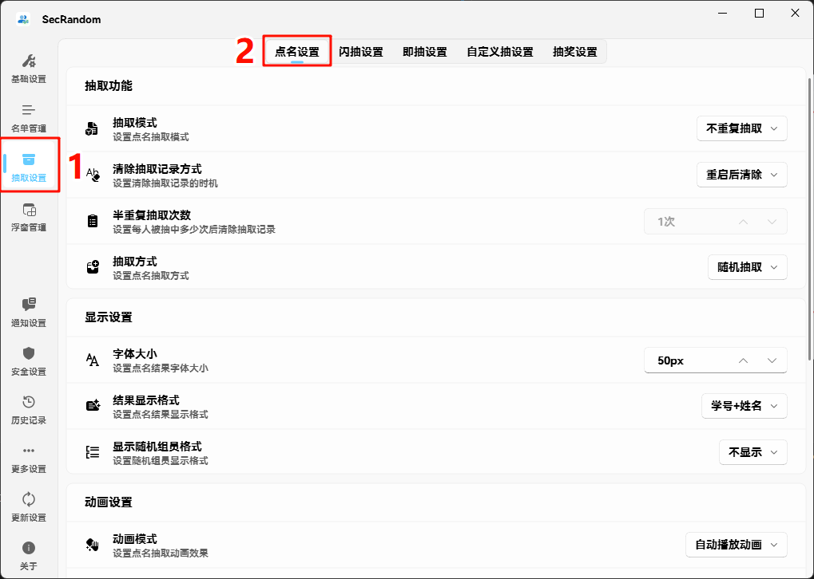

# Prize Extraction Configuration 🎁

## 🚀 Quick Start

### 📋 Configure Prize Extraction Settings

::: tip Three Steps to Complete
Just three simple steps to configure the perfect prize draw experience!
:::

#### 1️⃣ Open Settings Interface
- **Method 1**: Right-click tray icon → Select "Settings"

#### 2️⃣ Navigate to Prize Extraction Settings
- Left sidebar → **"Extraction Settings"**
- Right panel → **"Prize Extraction Settings"**


#### 3️⃣ Personalized Configuration

| Configuration Item | Description | Suggested Value |
|-------------------|------------|-----------------|
| **Font Size** | Prize result display size | 10-2000px |
| **Animation Effect** | Prize draw process animation | Enabled |
| **Sound Effect** | Prize draw completion prompt sound | Optional |

---

## ⚖️ Prize Weight Configuration

### 🎯 Weight Concept
Weight determines the probability of each prize being drawn. **Higher value means higher probability**.

### � Configuration Steps

#### 1️⃣ Enter Prize List
- Settings interface → List Management → List Management

#### 2️⃣ Basic Configuration
- **Prize Pool Name**: Give your prize pool a name (e.g., "Final Term Prizes")
- **Prize List**: Enter all prize names in order

#### 3️⃣ Set Weights
Click **"Set Prize Weights"** button and enter corresponding weight values:

| Prize Example | Weight Setting | Probability Description |
|---------------|---------------|-------------------------|
| 🥇 First Prize | 10 | High probability |
| 🥈 Second Prize | 50 | Medium probability |
| 🥉 Third Prize | 100 | Low probability |
| 🎈 Participation Prize | 200 | Highest probability |

### ⚠️ Notes

::: warning Weight Setting Guidelines
- ❌ **Do not** use spaces as weight values
- ✅ **Recommend** using positive integers (1-1000)
- 🔄 **Unset** weights default to 1
:::

### 🧮 Weight Calculation Example

Assume the following prizes and weights are set:
```
Prizes: Tablet  Phone  Headphones  Mouse Pad
Weights:   10      50     100        200
```

**Probability Calculation**:
- Total weight = 10 + 50 + 100 + 200 = 360
- Tablet probability = 10/360 ≈ 2.78%
- Phone probability = 50/360 ≈ 13.89%
- Headphones probability = 100/360 ≈ 27.78%
- Mouse Pad probability = 200/360 ≈ 55.56%

### � Best Practices

#### 🎯 Fair Prize Draw Suggestions
- **Big Prizes**: Set lower weights (5-20)
- **Small Prizes**: Set higher weights (50-200)
- **Participation Prizes**: Set highest weights (200+)

#### 📈 Activity Type Recommendations
| Activity Type | Weight Configuration Suggestions |
|---------------|---------------------------------|
| **Classroom Prize Draw** | Big prize 10, small prize 50, participation prize 200 |
| **Annual Meeting Prize Draw** | Grand prize 5, first prize 10, second prize 20, third prize 50 |
| **Promotional Prize Draw** | Coupon 200, small gift 100, thank you for participating 500 |
