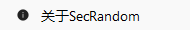

------

</style>}  }    padding: 15px;  .feature-card {    }    text-align: center;    flex-direction: column;  .feature-header {@media (max-width: 768px) {}  border-bottom: 1px solid #dee2e6;  text-align: left;  padding: 8px;.tray-section td {.tray-section th,}  border-collapse: collapse;  width: 100%;.tray-section table {}  margin: 15px 0;  padding: 15px;  border-radius: 8px;.tray-section {}  font-size: 0.75em;  border-radius: 12px;  padding: 4px 8px;  color: white;  background: #3498db;.feature-tag {}  flex-wrap: wrap;  gap: 8px;  display: flex;.feature-details {}  font-size: 0.9em;  color: #5a6c7d;  margin: 5px 0 0 0;.feature-info p {}  font-size: 1.2em;  color: #2c3e50;  margin: 0;.feature-info h4 {}  background: rgba(52, 152, 219, 0.1);  border-radius: 8px;  justify-content: center;  align-items: center;  display: flex;  font-size: 32px;  height: 48px;  width: 48px;.feature-icon {}  margin-bottom: 10px;  gap: 15px;  align-items: center;  display: flex;.feature-header {}  box-shadow: 0 6px 20px rgba(0,0,0,0.15);  transform: translateY(-2px);.feature-card:hover {}  transition: transform 0.3s ease;  box-shadow: 0 4px 15px rgba(0,0,0,0.1);  margin: 15px 0;  padding: 20px;  border-radius: 12px;  background: linear-gradient(135deg, #f5f7fa 0%, #c3cfe2 100%);.feature-card {<style>
|  | Restart/Exit | Program restart or safe exit ||  | Open Settings | Quick access to settings interface ||  | Show/Hide Floating Window | Control floating window display, only valid for current session ||  | Show/Hide Main Interface | Quick toggle window visibility ||  | About Information | Display program details ||----------|----------|----------|| Function Icon | Operation Name | Function Description |
#### 🎭 **Interface Control**### 🎛️ **Quick Operation Panel**## 🧵 System Tray Menu

  Contributors  Open Source License  Version Info

  
    
Version information, contributors, open source license
    <h4>About Information</h4>  
  
ℹ️

#### ℹ️ **About Information**

  
    
Complete draw history with export and analysis support
    <h4>History Records</h4>  
  
📊

#### 📊 **History Records**

  Multi-level Prizes  Prize Management

  
    
Prize extraction management with multi-level prize support
    <h4>Prize Drawing Mode</h4>  
  
🎁

#### 🎁 **Prize Drawing Mode**

  Group Management  Weight Algorithm  Education Specific

  
    
Intelligent random student selection with weight and grouping support
    <h4>Person Extraction Mode</h4>  
  
👥

#### 👥 **Person Extraction Mode**### 🎯 **Core Feature Areas**## 🧭 Main Interface Feature Navigation- **Focus Mode**: Reduces eye fatigue- **Eye Protection Index**: ⭐⭐⭐⭐⭐- **Color Characteristics**: Black background with white text- **Applicable Scenario**: Evening use, dark environments#### 🌙 **Dark Theme**- **Energy Optimization**: ⭐⭐⭐⭐- **Eye Protection Index**: ⭐⭐⭐- **Color Characteristics**: White background with black text- **Applicable Scenario**: Classrooms, offices and other bright environments#### ☀️ **Light Theme**### 🌈 **Preset Theme Plans**## 🎨 Themes and PersonalizationSecRandom adopts modern interface design principles, allowing every user to get started quickly through clear hierarchy and intuitive operation flow. The interface supports **intelligent adaptation** and **personalized customization**, perfectly fitting different usage scenarios.## 🎯 Interface Overview> 🎨 **Intuitive and Easy-to-Use Interface Design** - Modern interactive experience optimized for educational scenarios# Interface Guide---createTime: 2025/11/29 12:58:02title: interfacetitle: interface
createTime: 2025/11/29 13:07:41
---
