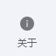

# 界面介绍

<ArticleMetadata />

> SecRandom采用现代化的界面设计，布局清晰直观，操作流程简洁明了。无论您是初次使用还是有经验的用户，都能快速上手并高效完成随机选择任务。本章将详细介绍软件的界面结构和各元素功能。

## 2.1 整体布局
软件界面采用经典的布局，形成层次分明的视觉结构

### 2.1.1 界面配色方案
软件提供多种预设主题，满足不同场景和个人偏好：
- **浅色主题**：白底黑字，搭配蓝色主色调，适合明亮环境使用
- **深色主题**：黑底白字，减轻眼部疲劳，适合昏暗环境使用

### 2.1.2 界面缩放与适配
- 支持窗口大小自由调整，界面元素会智能重排
- 可通过「设置→显示→缩放比例」调整界面元素大小（100%-200%）
- 自动适配不同分辨率显示器

### 2.2 主界面导航按钮
每个按钮高度约60px（系统缩放为100%的情况下），包含图标和文字说明，从上到下依次为：
#### 抽人模式按钮
- **图标**：  

- **功能**：切换到抽人功能界面

#### 抽奖模式按钮
- **图标**：  

- **功能**：切换到抽奖功能界面

#### 历史记录按钮
- **图标**：  

- **功能**：查看所有抽取记录

#### 关于按钮
- **图标**：  

- **功能**：显示程序信息，贡献者等信息

