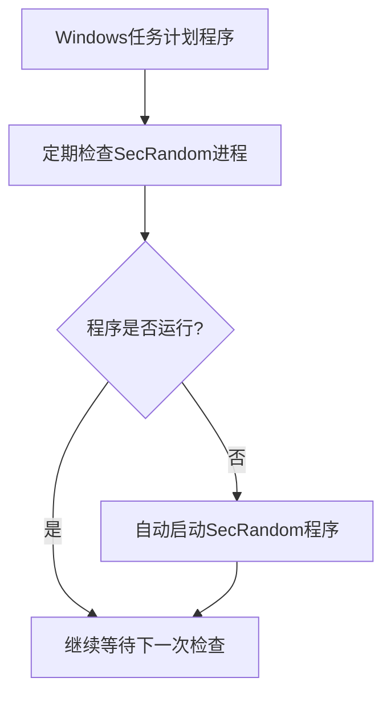

# SecRandom 系统级保活功能说明

<div align="center">


</div>

::: tip 功能概述
SecRandom 系统级保活功能是一种不需要目标计算机上安装Python环境的保活手段。它通过Windows任务计划程序实现，定期检查SecRandom程序是否在运行，如果程序被意外结束，则自动重新启动它。

✅ **无需Python环境** | ✅ **系统级守护** | ✅ **自动恢复** | ✅ **低资源占用**
:::

## 工作原理

<div align="center">



</div>

| 组件 | 功能描述 |
|:----:|:----------|
| **🔄 任务计划程序** | 利用Windows系统自带的任务计划程序功能，创建一个定期执行的任务 |
| **🔍 定期检查** | 任务每5分钟检查一次SecRandom程序是否在运行 |
| **🚀 自动重启** | 如果检测到程序未运行，则自动启动SecRandom程序 |
| **🔐 系统权限** | 任务以SYSTEM权限运行，确保即使没有用户登录也能正常工作 |

## 使用方法

### 手动运行批处理文件

::: info 操作步骤
<div align="center">

**📋 设置保活功能**

</div>

1. 在SecRandom程序目录中找到以下文件：
   - `setup_keep_alive.bat`：用于设置保活功能
   - `remove_keep_alive.bat`：用于移除保活功能
2. 右键点击`setup_keep_alive.bat`，选择"以管理员身份运行"
3. 等待批处理文件执行完成，您将看到保活任务设置成功的提示

<div align="center">

> 💡 **提示**：设置成功后，即使关闭SecRandom程序，它也会在5分钟内自动重新启动。

</div>
:::

## 注意事项

::: warning 重要提醒
<div align="center">

**⚠️ 请仔细阅读以下注意事项**

</div>

- **🔑 管理员权限**：设置和移除保活功能都需要管理员权限，请确保以管理员身份运行。
- **📦 可执行文件**：系统级保活功能需要打包后的可执行文件（SecRandom.exe）支持，如果未找到可执行文件，程序会提示您先打包程序。
- **🏷️ 任务名称**：保活任务在Windows任务计划程序中的名称为"SecRandomKeepAlive"。
- **⏱️ 执行间隔**：保活任务每5分钟检查一次程序是否在运行。
- **💻 兼容性**：此功能仅适用于Windows系统。

<div align="center">

> ⚠️ **警告**：不当使用此功能可能导致系统资源异常占用，请确保您了解其工作原理后再进行设置。

</div>
:::

## 如何验证保活功能是否正常工作

::: info 验证步骤
<div align="center">

**🔍 验证保活功能状态**

</div>

1. 打开Windows任务计划程序（可以在开始菜单搜索"任务计划程序"）
2. 在左侧导航栏中点击"任务计划程序库"
3. 在任务列表中查找名为"SecRandomKeepAlive"的任务
4. 如果找到该任务，说明保活功能已成功设置
5. 您可以右键点击该任务，选择"运行"来测试是否能正常启动SecRandom程序

<div align="center">

> ✅ **成功标志**：任务列表中存在"SecRandomKeepAlive"任务且状态为"就绪"。

</div>
:::

## 如何手动移除保活功能

### 方法一：通过程序界面移除

::: info 操作步骤
<div align="center">

**🖥️ 通过程序界面移除**

</div>

1. 打开SecRandom程序
2. 进入"设置"页面
3. 点击"高级设置"
4. 点击"移除系统级保活"按钮
5. 在弹出的确认对话框中点击"是"
6. 系统会弹出管理员权限请求，请点击"是"
7. 等待批处理文件执行完成，您将看到保活任务移除成功的提示
:::

### 方法二：手动运行批处理文件

::: info 操作步骤
<div align="center">

**📁 手动运行批处理文件**

</div>

1. 在SecRandom程序目录中找到`remove_keep_alive.bat`文件
2. 右键点击该文件，选择"以管理员身份运行"
3. 等待批处理文件执行完成，您将看到保活任务移除成功的提示
:::

### 方法三：通过任务计划程序移除

::: info 操作步骤
<div align="center">

**🗂️ 通过任务计划程序移除**

</div>

1. 打开Windows任务计划程序
2. 在左侧导航栏中点击"任务计划程序库"
3. 在任务列表中查找名为"SecRandomKeepAlive"的任务
4. 右键点击该任务，选择"禁用"或"删除"
:::

## 常见问题

<div align="center">

**❓ 常见问题解答**

</div>

::: details 为什么需要管理员权限？
<div align="center">

**🔑 权限问题**

</div>

因为创建和删除Windows任务计划程序需要管理员权限，这是Windows系统的安全要求。
:::

::: details 保活功能会影响系统性能吗？
<div align="center">

**⚡ 性能影响**

</div>

保活任务每5分钟运行一次，检查程序是否在运行，这个操作非常轻量，不会对系统性能产生明显影响。
:::

::: details 如果我不想使用保活功能了，如何完全移除？
<div align="center">

**🗑️ 完全移除**

</div>

您可以通过程序界面中的"移除系统级保活"按钮，或者手动运行`remove_keep_alive.bat`文件来移除保活功能。
:::

::: details 保活功能在重启电脑后还会生效吗？
<div align="center">

**🔄 重启后状态**

</div>

是的，保活任务设置为系统启动后自动运行，即使重启电脑后也会继续生效。
:::

::: details 我可以修改保活任务的检查间隔吗？
<div align="center">

**⏱️ 自定义间隔**

</div>

目前保活任务的检查间隔固定为5分钟，如果您需要自定义间隔，可以修改`setup_keep_alive.bat`文件中的相关参数。
:::

## 下载保活文件

<div align="center">

**📥 下载保活文件**

</div>

::: info 下载地址
您可以从以下链接下载SecRandom软件保活相关文件：

<div align="center">

| 文件类型 | 下载链接 |
|:--------:|:--------:|
| **📦 完整包** | [SecRandom-软件保护](https://www.123684.com/s/9529jv-MIGxh) |

</div>

该链接包含保活功能所需的批处理文件，点击链接即可访问123云盘下载页面。

<div align="center">

> 💡 **提示**：下载完成后，请解压文件并按照上述说明进行操作。

</div>
:::

## 技术细节

<div align="center">

**⚙️ 技术实现细节**

</div>

::: tip PowerShell脚本
保活功能通过以下PowerShell命令创建Windows任务计划程序：

```powershell
# 创建任务名称
$taskName = "SecRandomKeepAlive"

# 定义任务动作
$action = New-ScheduledTaskAction -Execute "SecRandom.exe的完整路径"

# 设置触发器（每5分钟运行一次）
$trigger = New-ScheduledTaskTrigger -Once -At (Get-Date) -RepetitionInterval (New-TimeSpan -Minutes 5) -RepetitionDuration (New-TimeSpan -Days 3650)

# 配置任务设置
$settings = New-ScheduledTaskSettingsSet -AllowStartIfOnBatteries -DontStopIfGoingOnBatteries -StartWhenAvailable -DontStopOnIdleEnd

# 设置运行权限（SYSTEM权限）
$principal = New-ScheduledTaskPrincipal -UserId "SYSTEM" -LogonType ServiceAccount

# 注册任务
Register-ScheduledTask -TaskName $taskName -Action $action -Trigger $trigger -Settings $settings -Principal $principal -Description "SecRandom保活守护任务"
```

这个命令创建了一个以SYSTEM权限运行的任务，每5分钟检查一次SecRandom程序是否在运行，如果未运行则自动启动它。

<div align="center">

> 💡 **技术说明**：该脚本使用Windows任务计划程序API创建系统级服务，确保SecRandom程序持续运行。

</div>
:::

<div align="center">

</div>